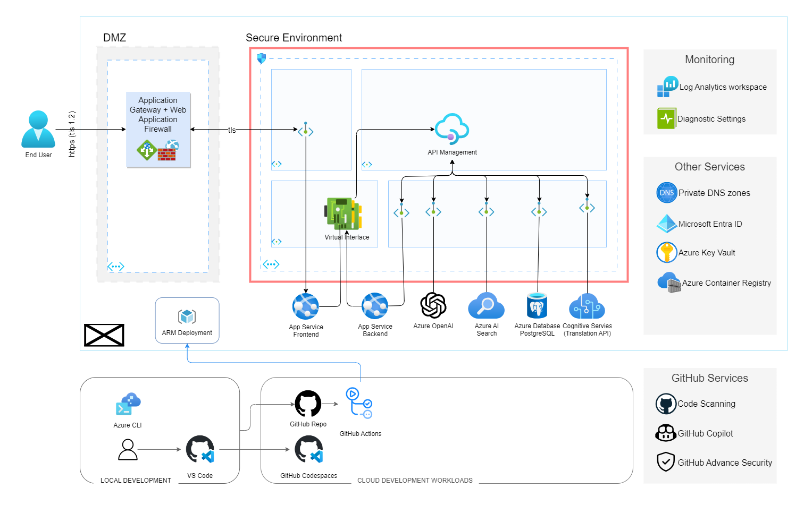

# React Boilerplate

This sample demonstrates a React SPA that authenticates users against Microsoft Entra External ID, using the Microsoft Authentication Library for React (MSAL React).

It then calls a custom api.

## Architecture Diagram



# Provision Resources

This project uses scripts to provision infrastructure, package, and deploy the application to Azure.

## Prerequisites

- Azure Subscription
- GitHub Account
- Azure CLI
- Node.js

**Install Azure CLI**

```bash
# Check if installed
az --version

# Install azure cli
curl -sL https://aka.ms/InstallAzureCLIDeb | sudo bash

az --version
```

## Create System Identities

The solution uses several system identities.

| System Identities        | Authentication                                             | Authorization                                                              | Purpose                                                                                                                                                                                               |
| ------------------------ | ---------------------------------------------------------- | -------------------------------------------------------------------------- | ----------------------------------------------------------------------------------------------------------------------------------------------------------------------------------------------------- |
| `env.CICD_CLIENT_NAME`   | OpenId Connect (OIDC) based Federated Identity Credentials | Subscription Contributor access                                            | Deploy cloud resources: <ul><li>core infrastructure</li><li>web app</li></ul>                                                                                                                         |
| `env.WEBAPP_CLIENT_NAME` | ClientID and Client Secret                                 | Microsoft Graph API permissions: <ul><li>Read User.ReadBasic.All</li></ul> | Uses the identity package to obtain an access token from the Microsoft Identity platform.<br>The access token is used as a bearer token to authenticate the user when calling the Microsoft Graph API |

Configure the environment variables. Copy `example.env` to `.env` and update the values

```bash
# load .env vars (optional)
[ ! -f .env ] || eval "export $(grep -v '^#' .env | xargs)"
# or this version allows variable substitution and quoted long values
[ -f .env ] && while IFS= read -r line; do [[ $line =~ ^[^#]*= ]] && eval "export $line"; done < .env

# Login to cloud cli. Only required once per install.
az login --tenant $AZURE_TENANT_ID

# Create CICD system identity
./script/create_cicd_sp.sh
# Adds CICD_CLIENT_ID=$created_clientid to .env

# Create webapp system identity
./script/create_webapp_sp
# Adds WEB_APP_CLIENT_ID=$created_clientid to .env
# Adds WEB_APP_CLIENT_SECRET=$created_secret to .env
```

## Configure GitHub

Create GitHub secrets for storing Azure configuration.

Open your GitHub repository and go to Settings.
Select Secrets and then New Secret.
Create secrets with values from `.env` for:

- `AZURE_TENANT_ID`
- `AZURE_SUBSCRIPTION_ID`
- `CICD_CLIENT_ID`
- `WEB_APP_CLIENT_ID`

## Provisioning

Running the following commands will provision cloud resources for deploying the application.

```bash
# Configure the environment variables. Copy `example.env` to `.env` and update the values
cp example.env .env
# load .env vars
[ ! -f .env ] || export $(grep -v '^#' .env | xargs)
# or this version allows variable substitution and quoted long values
[ -f .env ] && while IFS= read -r line; do [[ $line =~ ^[^#]*= ]] && eval "export $line"; done < .env

# Login to az. Only required once per install.
az login --tenant $AZURE_TENANT_ID

# Provision infrastructure
./scripts/devops.sh provision --name "$APP_NAME" --environment "$ENV"
# adds the TBD to .env

```

Once deployed, add additional secrets to GitHub for:

- `TBD` as `TBD`

# Development

You'll need to set up a development environment if you want to develop a new feature or fix issues. The project uses a docker based devcontainer to ensure a consistent development environment.

- Open the project in VSCode and it will prompt you to open the project in a devcontainer. This will have all the required tools installed and configured.

## Setup local dev environment

If you use the devcontainer image you need to log into the Container registry

```bash
# load .env vars (optional)
[ -f .env ] && while IFS= read -r line; do [[ $line =~ ^[^#]*= ]] && eval "export $line"; done < .env

az login --use-device-code --tenant "$AZURE_TENANT_ID"
az acr login --name $REGISTRY_LOGIN_SERVER
```

If you want to develop outside of a docker devcontainer you can use the following commands to setup your environment.

```bash
# Configure the environment variables. Copy example.env to .env and update the values
cp example.env .env

# load .env vars
# [ ! -f .env ] || export $(grep -v '^#' .env | xargs)
# or this version allows variable substitution and quoted long values
# [ -f .env ] && while IFS= read -r line; do [[ $line =~ ^[^#]*= ]] && eval "export $line"; done < .env

# Install Node.js version 18 or greater

```

## Tasks

The devcontainer comes with some useful tasks to help you with development, you can start these tasks by opening the command palette with `Shift`+`Command`+`P`(Mac) / `Ctrl`+`Shift`+`P` (Windows/Linux) and select `Tasks: Run Task` then select the task you want to run.

- `Run Front End` - Run the front end.

If you want to run these tasks outside of the devcontainer you can use the following commands.

```bash
# Run Front End.
cd ./fontend
npm run dev
```

## Style Guidelines

TBD

## Testing

Ideally, all code is checked to verify the following:

All the unit tests pass All code passes the checks from the linting tools To run the linters, run the following commands:

TBD

```

# References

- https://react.dev/learn/start-a-new-react-project
- https://nextjs.org/learn-pages-router/basics/create-nextjs-app
- App Service Plans Bicep Schema https://learn.microsoft.com/en-us/azure/templates/microsoft.web/serverfarms?pivots=deployment-language-bicep#skudescription

```
